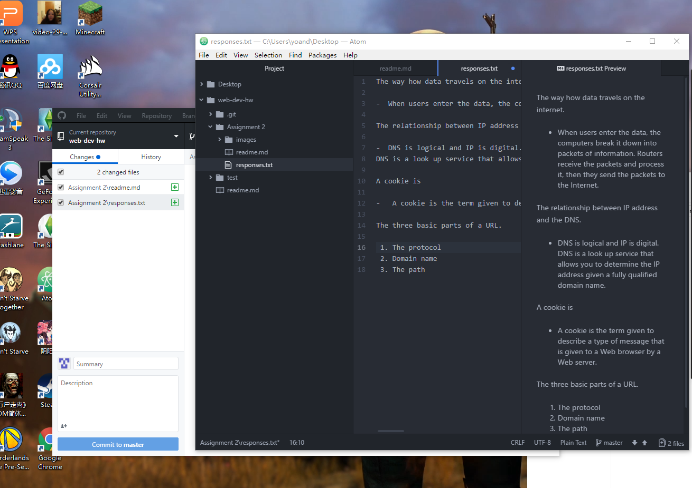

# Assignment 2

A version control systerm is a software that help us manage changes to sources code overtime. The reason why we use it in this class is because it can make us fix ciding error easier.

Here is my [responses](./notes.txt).

As a business student, this assiment is really a hard work for me. It took me 4 hours to figure out how to do it. When I opened the Atom, I coudn't find the menu bar which drove me crazy. Then I uninstalled my Atom and installed it for many times. Finally I found the right solution on Google. This issue took me one hour. Before assignment 2, I even don't know what GitHub is. And now I know how it works with Atom. This class must be a very important experience of my college life, it's hard but interesting.

