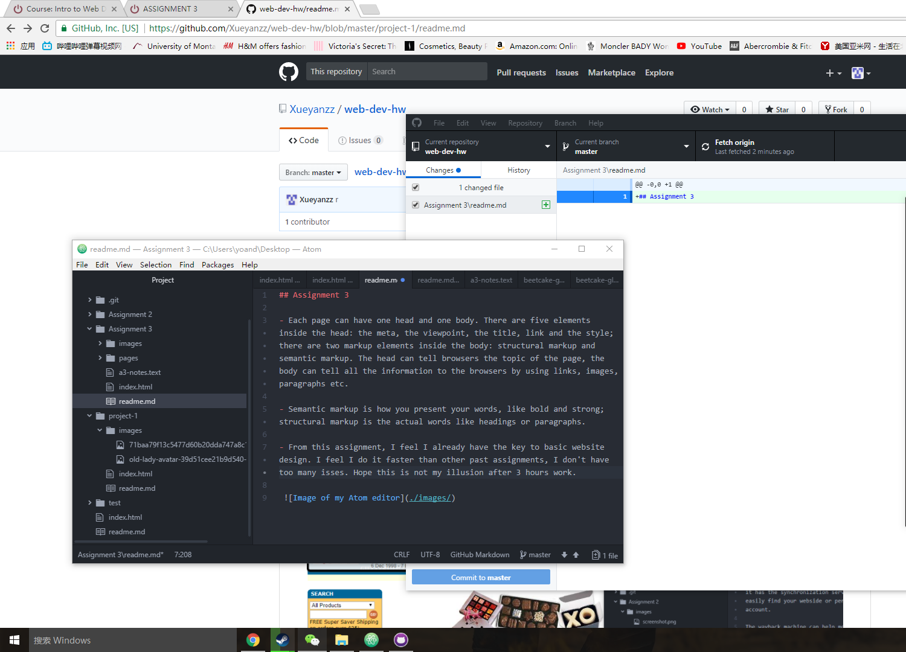

## Assignment 3

- Each page can have one head and one body. There are five elements inside the head: the meta, the viewpoint, the title, link and the style; there are two markup elements inside the body: structural markup and semantic markup. The head can tell browsers the topic of the page, the body can tell all the information to the browsers by using links, images, paragraphs etc.

- Semantic markup is how you present your words, like bold and strong; structural markup is the actual words like headings or paragraphs.

- From this assignment, I feel I already have the key to basic website design. I feel I do it faster than other past assignments, I don't have too many isses. Hope this is not my illusion after 3 hours work.

 
