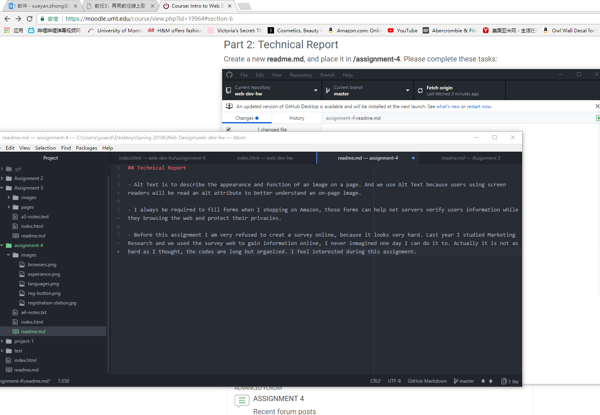

## Technical Report

- Alt Text is to describe the appearance and function of an image on a page. And we use Alt Text because users using screen readers will be read an alt attribute to better understand an on-page image.

- I always be required to fill forms when I shopping on Amazon, those forms can help net servers verify users information while they browsing the web and protect their privacies.

- Before this assignment I am very refused to creat a survey online, because it looks very hard. Last year I studied Marketing Research and we used the survey web to gain information online, I never inmagined one day I can do it to. Actually it is not as hard as I thought, the codes are long but organized. I feel interested during this assignment.

