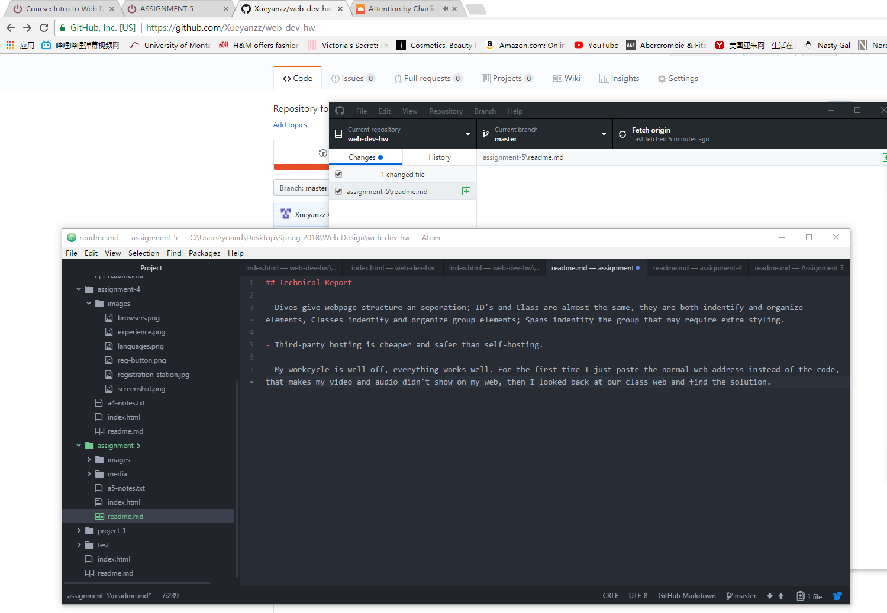

## Technical Report

- Dives give webpage structure an seperation; ID's and Class are almost the same, they are both indentify and organize elements, Classes indentify and organize group elements; Spans indentity the group that may require extra styling.

- Third-party hosting is cheaper and safer than self-hosting.

- My workcycle is well-off, everything works well. For the first time I just paste the normal web address instead of the code, that makes my video and audio didn't show on my web, then I looked back at our class web and find the solution.    

