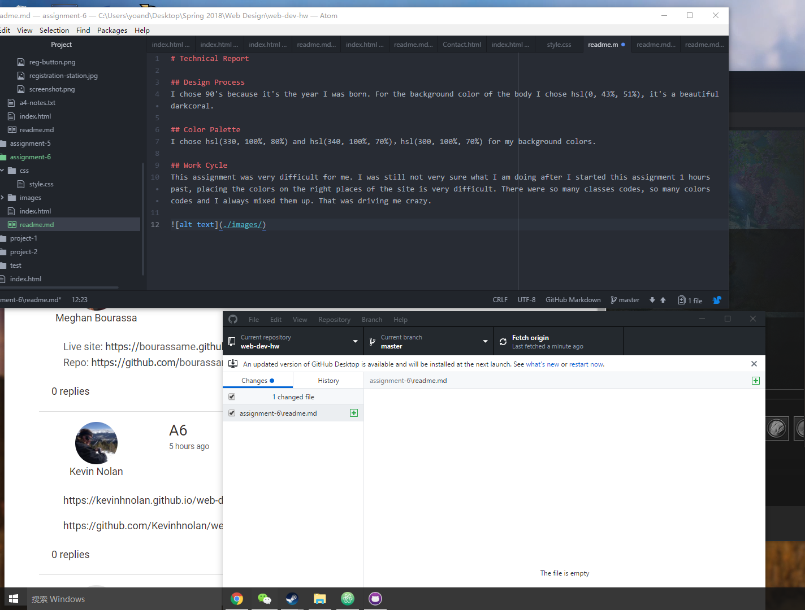

# Technical Report

## Design Process
I chose 90's because it's the year I was born. For the background color of the body I chose hsl(0, 43%, 51%), it's a beautiful darkcoral.

## Color Palette
I chose hsl(330, 100%, 80%) and hsl(340, 100%, 70%)，hsl(300, 100%, 70%) for my background colors.

## Work Cycle
This assignment was very difficult for me. I was still not very sure what I am doing after I started this assignment 1 hours past, placing the colors on the right places of the site is very difficult. There were so many classes codes, so many colors codes and I always mixed them up. That was driving me crazy.

