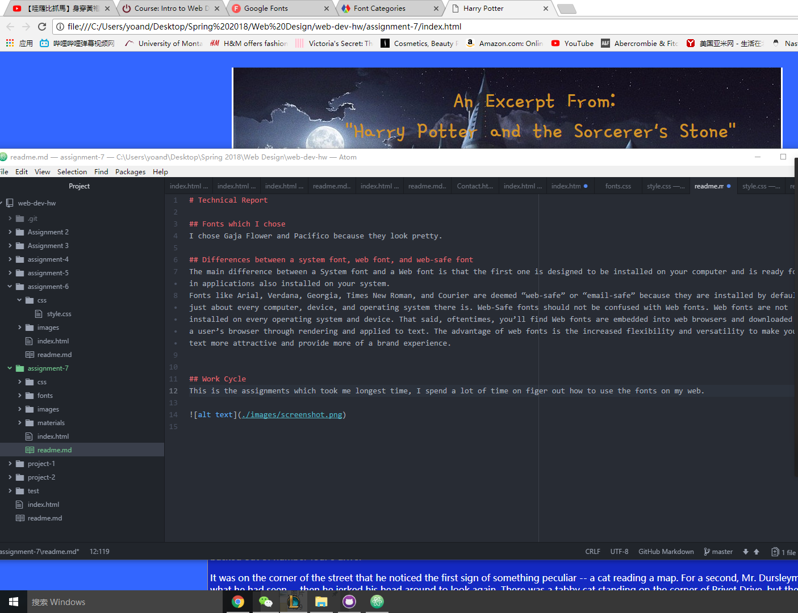

# Technical Report

## Fonts which I chose
I chose Gaja Flower and Pacifico because they look pretty.

## Differences between a system font, web font, and web-safe font
The main difference between a System font and a Web font is that the first one is designed to be installed on your computer and is ready for use in applications also installed on your system.
Fonts like Arial, Verdana, Georgia, Times New Roman, and Courier are deemed “web-safe” or “email-safe” because they are installed by default on just about every computer, device, and operating system there is. Web-Safe fonts should not be confused with Web fonts. Web fonts are not installed on every operating system and device. That said, oftentimes, you’ll find Web fonts are embedded into web browsers and downloaded into a user’s browser through rendering and applied to text. The advantage of web fonts is the increased flexibility and versatility to make your text more attractive and provide more of a brand experience.

## Work Cycle
This is the assignments which took me longest time, I spend a lot of time on figer out how to use the fonts on my web.

