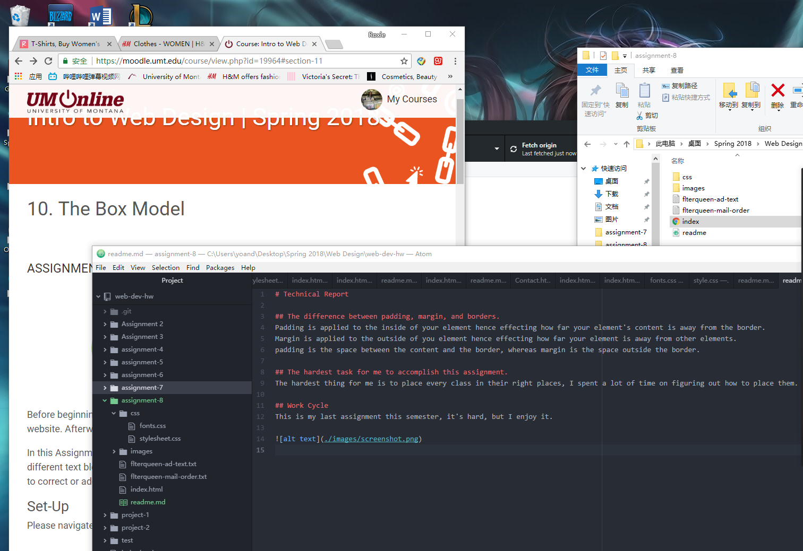

# Technical Report

## The difference between padding, margin, and borders.
Padding is applied to the inside of your element hence effecting how far your element's content is away from the border.
Margin is applied to the outside of you element hence effecting how far your element is away from other elements.
padding is the space between the content and the border, whereas margin is the space outside the border.

## The hardest task for me to accomplish this assignment.
The hardest thing for me is to place every class in their right places, I spent a lot of time on figuring out how to place them.

## Work Cycle
This is my last assignment this semester, it's hard, but I enjoy it.

