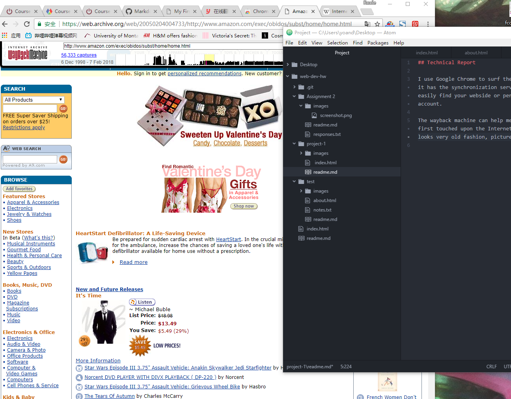

## Technical Report

I use Google Chrome to surf the web, it's very convenient and fast because it has the synchronization service. When you buy a new computer, you can easily find your webside or perferences on Google Chrome by logging in your account.

The wayback machine can help me to find the old websites I browsed when I first touched upon the Internet. I visited a site snapshot of Amazon. It looks very old fashion, pictures are very small and they are just pictures. And noadays, Amazon.com has more pictures and classification of goods. The website is clear and functional.

This project is a nigntmare. At the beginning I followed the steps on moodle, it's not a hard work. But When I finished my project I found that I can't find it on live site, evrytime I click "Project 1", it shows 404. I tried to solve this problem for one or more hours but I still can't find the solution, my project page works well and I can find the "Test" link. This is a big problem for me. Finally, I found what I missed, when I created the "index.html" file in my "project-1" folder, I typed a space but I didn't realize. That's what drives me crazy tonight. 

 
