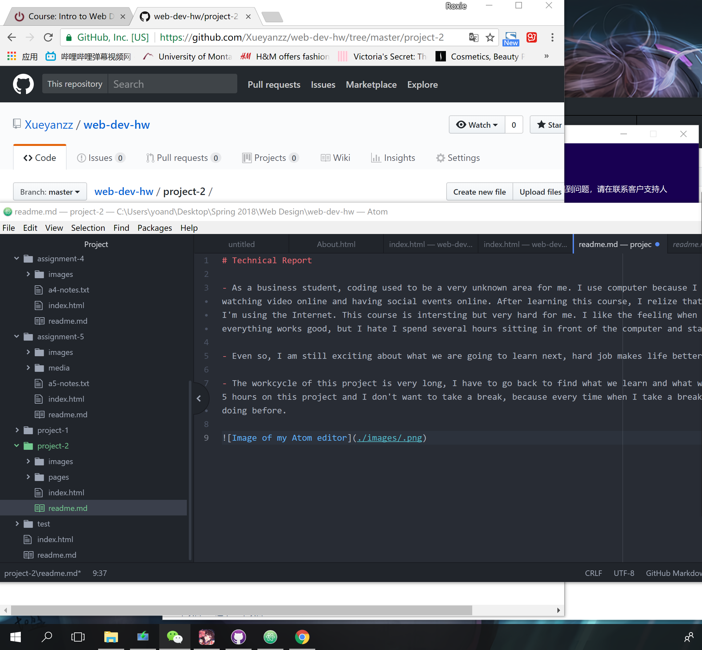

# Technical Report

- As a business student, coding used to be a very unknown area for me. I use computer because I enioy shopping online, watching video online and having social events online. After learning this course, I relize that coding is everywhere when I'm using the Internet. This course is intersting but very hard for me. I like the feeling when I finish my homework and find everything works good, but I hate I spend several hours sitting in front of the computer and staring at the codes.

- Even so, I am still exciting about what we are going to learn next, hard job makes life better.

- The workcycle of this project is very long, I have to go back to find what we learn and what we did for many times. I spent 5 hours on this project and I don't want to take a break, because every time when I take a break, I will forget what I was doing before.  

